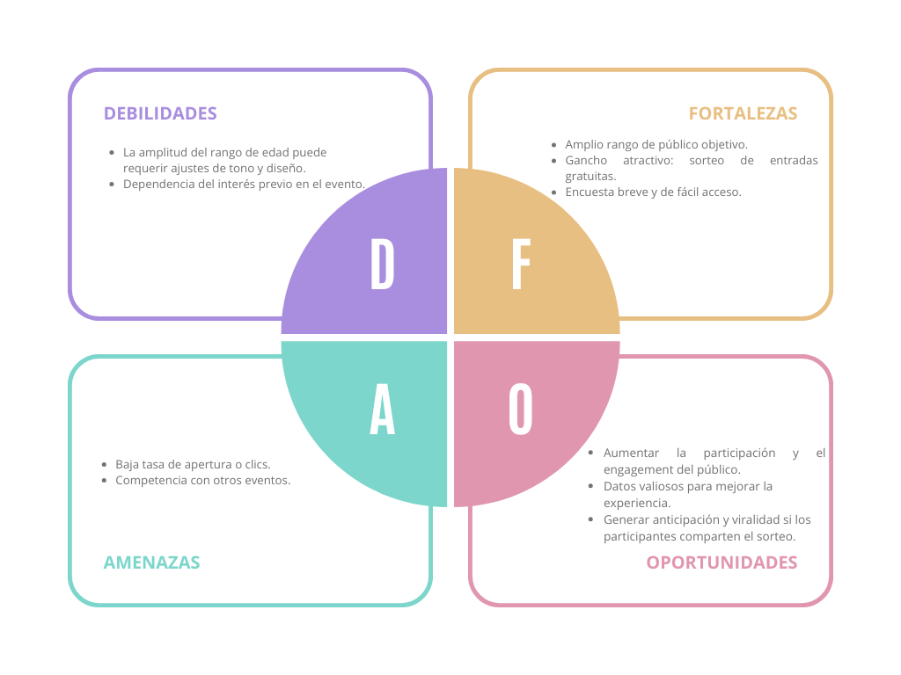
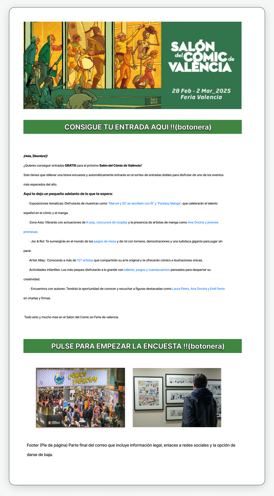
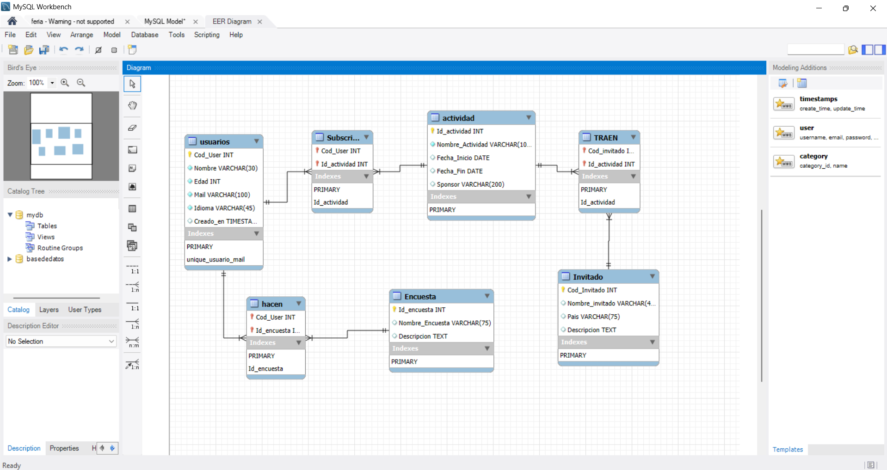

# Feria_vlc
Todos los supuestos de las practicas de feria valencia

# Supuesto 1
Creación de un boletín informativo para Salón del Cómic de València, destacando noticias y promociones especiales.

---

# 1. Análisis de requerimientos: 
El correo está dirigido a un público amplio, con edades comprendidas entre los 16 y 60 años, interesado en el mundo del cómic, manga, ilustración, cultura pop, cosplay y juegos de mesa y rol.

Se trata de un segmento diverso que abarca desde nuevos aficionados hasta seguidores consolidados, por lo que el mensaje utiliza un tono entusiasta, cercano y adaptable para conectar con todas las franjas de edad, sin caer en excesos de informalidad.

El objetivo principal de esta comunicación es incentivar la participación en una encuesta breve mediante la posibilidad de ganar entradas dobles para el Salón del Cómic de València 2026, promoviendo así la implicación del público y recogiendo información valiosa para mejorar la experiencia del evento.

# · DAFO

---
# 2. DISEÑO 

Aqui tenemos el primer diseño del correo.

# · Mockup

# · Elementos visuales utilizados

    Encabezado con imagen del evento:

Refuerza la identidad visual del Salón del Cómic (marca, fecha, lugar).

Ilustración llamativa que conecta con la estética del cómic.

    Botones destacados (CTA):

Uso de botoneras verdes con texto en mayúsculas para captar atención inmediata.

CTA inicial: "Consigue tu entrada aquí".

CTA final: "Pulse para empezar la encuesta".

Ambas llamadas a la acción están bien posicionadas (al inicio y al final), facilitando el clic rápido.

    Bloque de texto informativo:

Tono entusiasta y directo, pensado para ser comprendido rápidamente por lectores de cualquier edad.

Uso de negritas y enlaces en azul para destacar puntos clave: actividades, nombres de artistas y experiencias.

    Listado por puntos (bullet-like):

Permite escaneo rápido del contenido, ideal para usuarios con poco tiempo.

Divide las actividades en bloques temáticos reconocibles.

    Imágenes intermedias (zona inferior):

Refuerzan el aspecto emocional y visual del evento: comunidad, exposiciones, asistencia masiva.

Sirven de apoyo visual sin distraer del CTA principal.

    Footer (pie de página):

Espacio reservado para información legal, redes sociales y enlace de baja, cumpliendo con los estándares de email marketing (RGPD/GDPR).

---
# 3. BASE DE DATOS

ENTIDADES (Tablas principales)
1. 🧍‍♂️ Usuarios
Clave primaria: COD_USUARIOS

Atributos: Nombre, EDAD, MAIL (único), IDIOMA

2. 📝 ENCUESTA
Clave primaria: ID_ENCUESTA

Atributos: NOMBRE_ENCUESTA, DESCRIPCION

3. 🎯 ACTIVIDADES
Clave primaria: ID_ACTIVIDAD

Atributos: NOMBRE_ACTIVIDAD, FECHA_INICIO, FECHA_FIN, SPONSORS

4. 👤 INVITADO
Clave primaria: COD_INVITADOS

Atributos: NOMBRE, APELLIDO, PAIS, DESCRIPCION

🔁 RELACIONES (Tablas intermedias)
5. 👔 SUBSCRITO
Une: USUARIOS ↔ ACTIVIDADES

Atributos: COD_USUARIOS, ID_ACTIVIDAD

Tipo de relación: Muchos a muchos (n:n)

6. ✅ HACEN
Une: USER ↔ ENCUESTA

Atributos: COD_USUARIOS, ID_ENCUESTA

Tipo de relación: Muchos a muchos (n:n)

7. 🎤 TRAEN
Une: ACTIVIDADES ↔ INVITADO

Atributos: ID_ACTIVIDAD, COD_INVITADO

Tipo de relación: Muchos a muchos (n:n)

🎓 DIAGRAMA E-R CONCEPTUAL (Descripción textual)
Un USUARIO puede:

Participar en muchas ACTIVIDADES (por SUBSCRITO)

Contestar muchas ENCUESTAS (por HACEN)

Una ENCUESTA puede:

Ser contestada por varios Usuarios

Una ACTIVIDAD puede:

Tener muchos USUARIOS asignados (por Subscritos)

Tener muchos INVITADO (por TRAEN)

Un INVITADO puede:

Participar en varias ACTIVIDADES

# Diagrama base de datos

